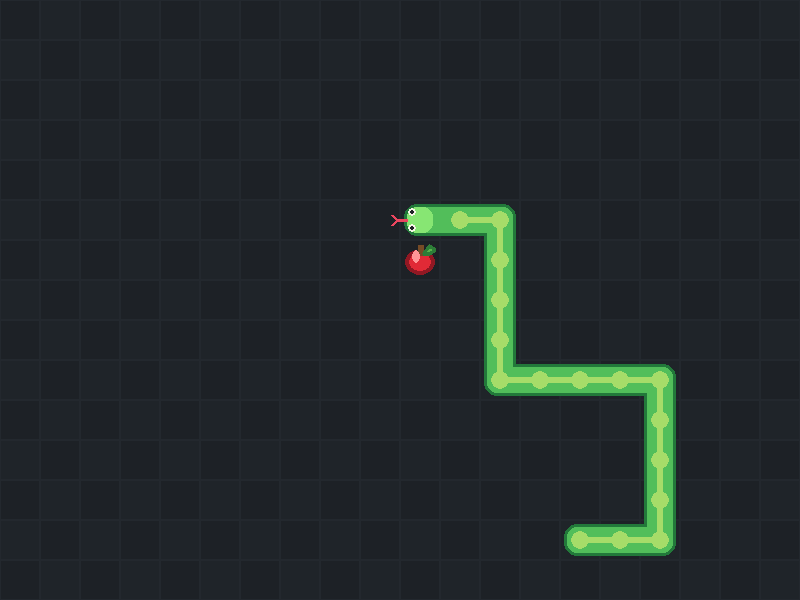

# 🐍 Vim Snake

Vim Snake is a minimalist snake clone built with pygame, designed around classic
vim movement keys. Loose yourself in the simplicity of the fun game and work your vim
movement muscle memory at the same time!



## Why Vim Snake

Ever found yourself wanting to play snake but you're a vim motions lover? Well
that was me, so I decided to just build it myself real quick. Keep in mind it is
a very small and simple game tailored to my very minimal needs.

## Quick Start

```bash
# clone this repo
git clone https://github.com/nick-ob/vim-snake
cd vim-snake

# install requirements
python -m pip install pygame

# run the game
python main.py
```

## How It Works

- The snake moves on a fixed-size grid.
- Eat red food blocks to grow.
- Colliding with yourself or the walls resets the game.
- The game ticks at a steady pace for consistent movement.

## Controls

- `h` move left
- `j` move down
- `k` move up
- `l` move right

## Project Structure

```text
vim-snake/
|-- main.py
|-- assets/
|   |-- preview.png
|-- .gitignore
|-- README
|-- LICENSE
```

## Tech Stack

- **Python**
- **Pygame**

## License

MIT — See [LICENSE](LICENSE)
